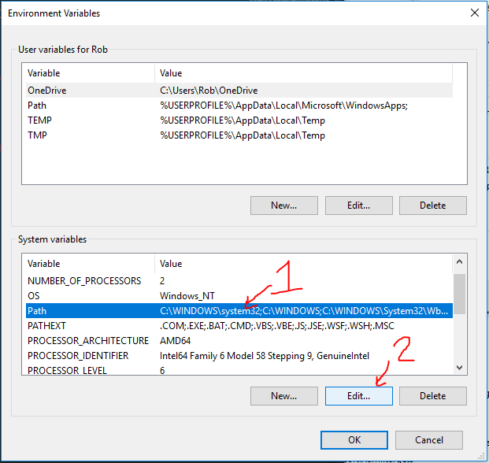

MSBuild
=======

MSBuild is installed with .NET 4.0 in `C:\Windows\Microsoft.NET\Framework64\v4.0.30319`, but this won't build .NET 4.5 or 4.6 projects.  Let's install a more recent version of MSBuild.

Install
-------

1. Download [Microsoft Build Tools](https://www.microsoft.com/en-us/download/details.aspx?id=48159)

2. Launch `BuildTools_Full.exe`.

3. Push next, and complete the install.

4. Restart any services or terminals that depend on msbuild to update the `PATH` environment variable.

5. From a machine with Visual Studio installed, copy the `C:\Program Files (x86)\MSBuild\Microsoft` folder and merge it into the folder on this machine.  On the thumb drive, this is `MSBuild-Microsoft.zip`.  This puts the `*.targets` files into place for building weird things.

Configure
---------

Let's add MSBuild to the `PATH` environment variable so commands can use it without specifying the full path.

1. Start -> Type `environment variables` to launch `Edit System Environment Variables`

2. Click `Environment Variables...`

3. In the lower `System` section, choose `PATH` and click `Edit`

4. Add `C:\Program Files (x86)\MSBuild\14.0\Bin` to the list, ensuring it's above any `C:\Windows\Microsoft.NET\Framework` directories.

5. Restart any services or terminals that depend on MSBuild to update the `PATH` environment variable.

Test it out
-----------

1. Open a new command prompt in any directory.  *Note*: because we just changed the `PATH` environment variable, existing processes and shells won't be able to run msbuild.

2. Type `msbuild /version`.

3. If you don't see any errors, it worked.
