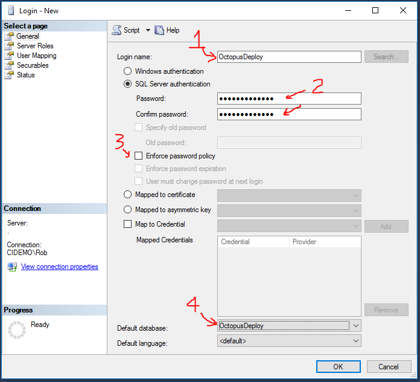

OCTOPUS DEPLOY
==============

Octopus Deploy takes build assets (applications and databases) and deploys them to each environment.  It's easy to promote builds up the stream from dev to test to QA to production.  Octopus is [free](https://octopus.com/purchase) for small teams for commercial use.

Install
-------

1. Download [Octopus Server](https://octopus.com/downloads).

2. Launch `Octopus.bunch_of_numbers.msi`.

3. Push Next a bunch of times.

4. Click Finish to launch the Octopus Manager.

Setup: Create Windows User
--------------------------

We'll need a Windows account to run the Octopus Deploy website and tentacle agent.  Technically these can run under the `SYSTEM` account, but there's cases where you'll want to login as the OctopusDeploy account to install certificates or adjust registry keys.  Better to run Octopus as a regular user.

You could choose to make this a domain user rather than a local user.

1. Right click on `This PC` (formerly `My Computer`), and choose Manage.

2. Choose Local Users and Groups then Users.

3. Right-click in the main window and choose `New User`.

4. Enter necessary user details.

5. Ensure `User must change password` is **not** checked, `User cannot change password` is checked, and `Password never expires` is checked.

6. Click `Create`.

7. Open the newly created user, choose `Member Of`, and add `Administrators`.  The user may stop and start services, configure IIS settings, or other behaviors restricted to administrative users, so best to give this account access up front.

Setup: Create Database
----------------------

TeamCity will connect via username/password to SQL Server, so let's set up a database and user.

1. Start -> SQL Server Management Studio (SSMS)

2. Connect to the local database using Windows Authentication.

3. Right-click on Databases, and choose `New Database`.

4. Enter a Database Name, and click Create.

5. Inside Security, right-click on Logins and choose `New Login`.

6. Enter the Login Name, password, uncheck `Enforce password policy`, and change the Default database to the database created above.

7. Switch to the `User Mapping` page, and set:

  a. Check the database created above.

  b. Set default schema to `dbo`.

  c. Check `db_owner` because Octopus Deploy will create tables.

(Technically you only need `db_owner` as you first configure Octopus Deploy and whenever you upgrade to a new version.)

8. Click `OK` to create the user.

Configure
---------

1. Sadly, you must sign up for the 45-day free trial of the Pro version on startup.  We'll quickly flip to the community edition after we install.

2. Choose `Custom Domain Account`, then click `Select User` to pick the Windows user you created above.

3. Set Server Name to `(local)`, choose `SQL Server Authentication`, and enter the database credentials and database name you created above.

4. Change the port to `8090` because IIS runs on port 80 by default.

5. Create the first user account to the web portal.

6. Click next a few more times and finish to kick off the install.

7. Click `Open in browser` to launch the Octopus web portal.

8. After logging in, click Configuration on the top-right.

9. In License, switch to `Community Edition` and save.

Octopus Deploy is now setup and ready to setup deployments.  Kudos to the Octopus team for the helpful setup experience that'll walk us through this process.

Backup Master Key
-----------------

Optional: [backup your master key](https://octopus.com/docs/reference/security-and-encryption) to be able to safely restore secrets stored in Octopus.
