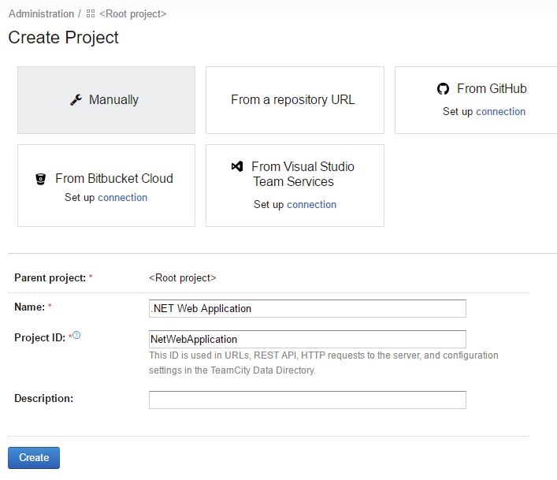
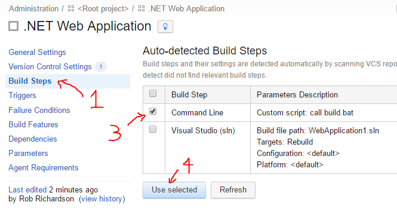
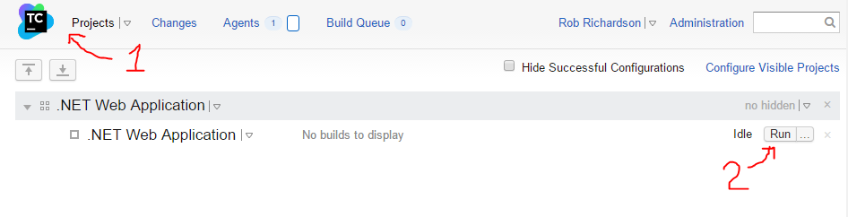
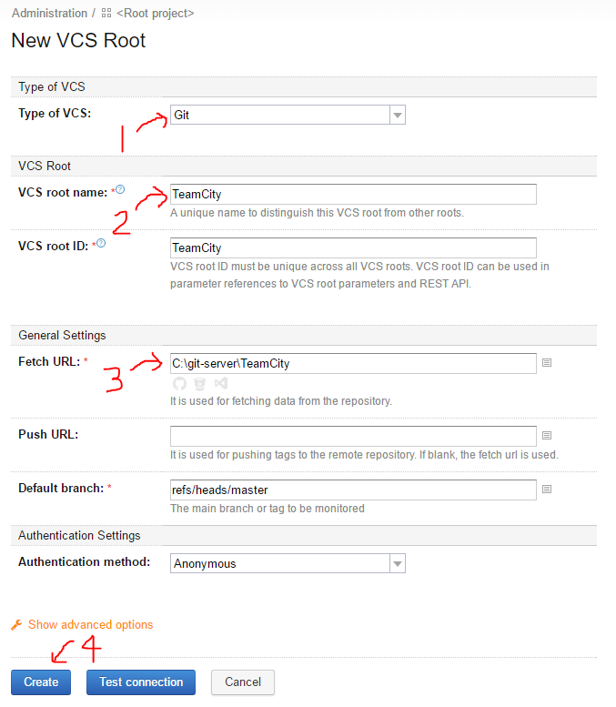
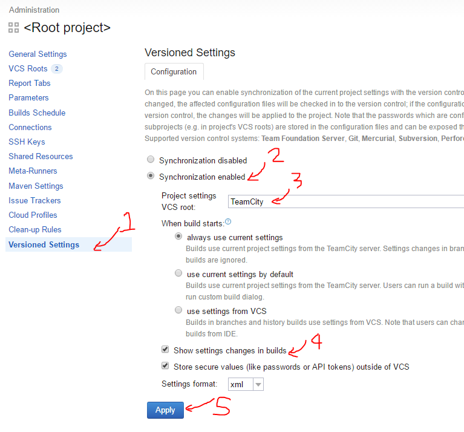

TEAMCITY BUILD
==============

We've already got TeamCity running on [port 8080](http://localhost:8080).  Let's create a build.

Configure
---------

1. Click Administration on the top-right.

2. Click `Create project`.

3. Click `Manually`.  Though the "From a repository URL" is enticing, our repository url is just a local folder, so it's difficult for TeamCity to discover things about it.

4. Enter a project name, the Project ID will get filled out automatically.

5. Click `Create`.

6. In the next screen, click `Create build configuration`.

7. Again click `Manually`, enter a name, and the Build configuration will get filled out automatically.

8. Click `Create`.

Create link to Version Control
------------------------------

A "VCS Root" is a link to the source control repository the build will use.

1. In the next screen, switch `Type of VCS` from Guess to `Git`.

2. Enter a `VCS Root name`.

3. Enter the Fetch URL as `C:\git-server\DotNetWebsite`.

4. Optional: Click `Advanced Options`, and change `Username style` to `Author Name and Email`.

5. Click `Create`.

Create Build Steps
------------------

1. Choose `Build Steps` from the menu on the left.

2. Click `Auto-detect build steps`.

3. Choose `Custom script: call build.bat` from the returned list, and click "Use selected".

Though the solution step is intriguing, our build script will be versioned with our project, freeing us from potential plugin collision.

Source change -> Build trigger
------------------------------

1. Choose Triggers

2. `Add a new trigger`

3. Choose `VCS trigger`

4. Click Save.

This will start the build every time TeamCity discovers a source code change.

Show Test Results
-----------------

1. Choose Build Features.

2. Click `Add a build feature`.

3. Choose `XML report processing` from the drop-down.

4. Report type is `NUnit`.

5. Monitoring rules is the file path to match: `*.Tests.xml`

6. Click `Save`.

Test it out
-----------

Now that we've got our build configured, let's run it.

1. Click on the TeamCity logo or `Projects` in the top-right.

2. Click `Run` on the far right of the build we created.

3. In a minute or two, the build will go green. Congratulations! Celebrate!

4. Click on the "Tests passed" link to see details about the build including test results, build log, and git commit details.

Optional: Save TeamCity configuration to Source Control
-------------------------------------------------------

Optional: TeamCity can save the configuration to source control so you can keep track of how build configurations evolve.

1. Create `C:\git-server\TeamCity` folder.

2. Open command prompt in this folder.

3. Type `git init --bare`.

4. In TeamCity dashboard, click `Administration`.

5. Click `Projects`.

6. Click `Root Project`.

7. Click `VCS Roots`.

8. Click `Create VCS Root`.

9. Name the root `TeamCity`.

10. Set the `Fetch URL` to `C:\git-server\TeamCity`.

11. From the menu on the left, choose `Versioned Settings` at the bottom.

12. Click `Synchronization enabled`.

13. Choose the `TeamCity` VCS root.

14. Click on `Show settings changes in builds`.

15. Click Apply.

