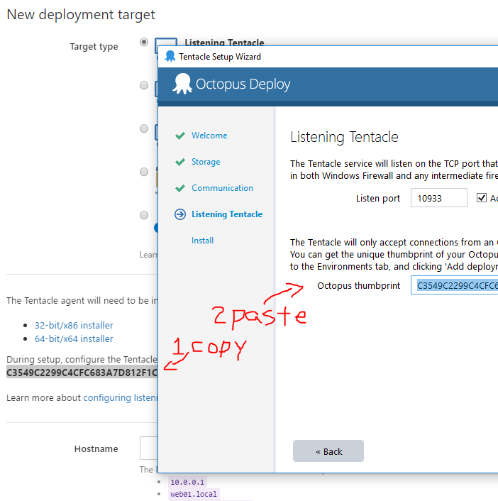
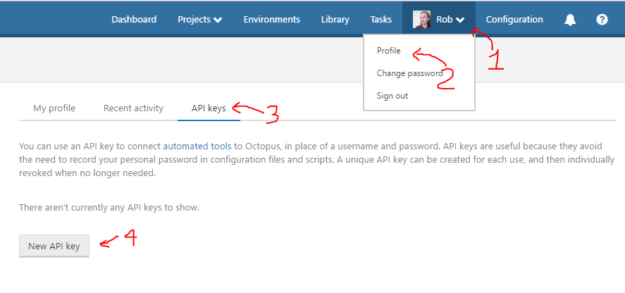
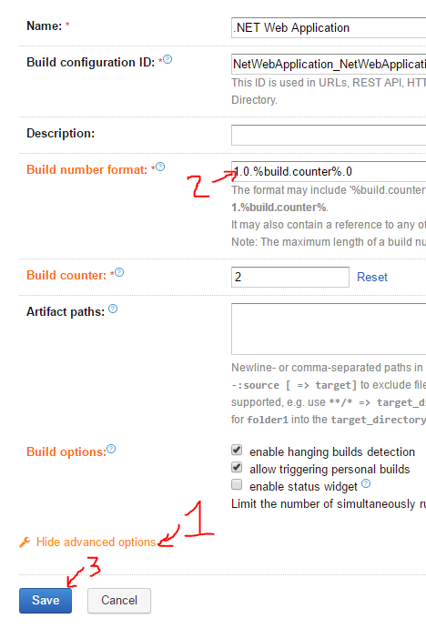
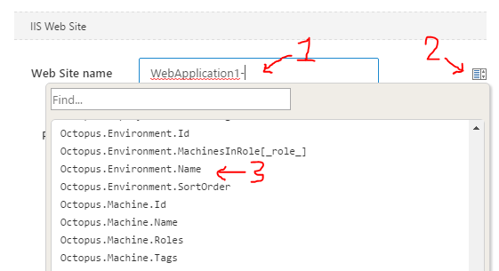

OCTOPUS DEPLOY BUILD
====================

Now that we have a TeamCity build, let's deploy it to IIS with Octopus Deploy.  Octopus Deploy's setup wizard is wonderful at guiding us through all the things.


Create Environments
-------------------

An environment represents a deployment phase.  For example, we could have multiple "Dev" servers, some "Web" servers, some "Database" servers, but all "Dev" servers.  "Dev" is the environment, "10.0.0.1" is the "Deployment Target", "Web" is the role.

1. Launch Octopus Web Dashboard at [http://localhost:8090](http://localhost:8090).

2. Click `Create environments` in `Step 2: Configure`.

3. Click `Add your first Environment`.

4. Name the environment `Dev` and click `Save`.

5. Click `Add Deployment Target`.

6. Choose `Listening Tentacle`.

7. The screen now prompts you to download the [`64-bit installer`](https://octopus.com/downloads), and shows you the `thumbprint`.

8. Leave this window open, and let's install the tentacle.


Installing the Tentacle
-----------------------

The tentacle is the agent running on each machine that Octopus will deploy software to.

1. Download the [`Octopus Tentacle`](https://octopus.com/downloads).

2. Launch `Octopus.Tentacle.bunch_of_numbers.msi`.

3. Click next many times, and click Finish to begin the install.

4. Click `Getting Started` to launch the tentacle setup wizard.

5. Click next a few times, noting these important settings:

  - Choose `Listening Tentacle`.

  - Copy the thumbprint from the Server webpage into the Tentacle dialog.



6. Leave the final page open so you can copy the tentacle thumbprint later.


Configure the Tentacle
----------------------

1. Back in the Octopus web dashboard, enter `localhost` for hostname.

2. Click `Discover`.

3. In the next screen, set Display Name to `Localhost-Dev`.

4. Environments is set to `Dev`.

5. In Roles, type `Web`.

6. Ensure the tentacle thumbprints match.


7. Click Save at the bottom.


Configure Test environment
--------------------------

1. Click `Add Environment` on the far right of the grey bar at the top (under the blue bar, above the green button).

2. Name this environment `Test` and click `Save`.

3. In the `Test` row, click `Add deployment target`.

4. Choose `Listening Tentacle`.

5. Set host name to `localhost`.

6. Click `Discover`.

7. Set Display name to `Localhost-Test`.

8. Environments is `Test`.

9. Set Roles to `Web`.

10. Validate the tentacle thumbprints match.

11. Click `Save` at the bottom.


Modify the Build
----------------

Next we need to build an Octopus Deploy package, push it to the Octopus server, and trigger a release.  We'll extend the build script to use [OctoPack](https://octopus.com/docs/packaging-applications/nuget-packages/using-octopack), and we'll leverage the `Octo.exe` command-line tool.

1. Already in the solution, the Web project contains the `OctoPack` NuGet package.  If this didn't exist, we'd fire up Visual Studio and add the package.

2. Open up the solution folder, and open up `build.bat` in your favorite editor.

3. Change the `msbuild` line to this to run Octopack:

```bash
msbuild WebApplication1.sln /m /p:Configuration=Release /t:Build /p:RunOctoPack=true
```

  We've added `/t:Build /p:RunOctoPack=true` to the end.

4. Add these new lines to the bottom to push the package to Octopus:

```bash
Octo.exe push --package WebApplication1\obj\octopacked\WebApplication1.%BUILD_NUMBER%.nupkg --replace-existing --server http://localhost:8090 --apiKey %OCTO_KEY%
if not %errorlevel% equ 0 (
	exit /b %errorlevel%
)
```

  This pushes the OctoPack package to Octopus Deploy.

5. Add these lines to the bottom:

```bash
Octo.exe create-release --project WebApplication1 --version %BUILD_NUMBER% --deployto=Dev --waitfordeployment --server http://localhost:8090 --apiKey %OCTO_KEY%
if not %errorlevel% equ 0 (
	exit /b %errorlevel%
)
```

  This creates an Octopus release and sends it to the Dev server(s).

6. Add these lines to the **top**:

```bash
PowerShell -NoProfile -NoLogo -ExecutionPolicy unrestricted -Command "(Get-Content WebApplication1\Properties\AssemblyInfo.cs).replace('1.0.0.0', '%BUILD_NUMBER%') | Set-Content WebApplication1\Properties\AssemblyInfo.cs"
if not %errorlevel% equ 0 (
	exit /b %errorlevel%
)
```

  This changes the `AssemblyInfo.cs` file so it'll bake the `BUILD_NUMBER` version into the app too.


The completed script now looks like this:

```bash
PowerShell -NoProfile -NoLogo -ExecutionPolicy unrestricted -Command "(Get-Content WebApplication1\Properties\AssemblyInfo.cs).replace('1.0.0.0', '%BUILD_NUMBER%') | Set-Content WebApplication1\Properties\AssemblyInfo.cs"
if not %errorlevel% equ 0 (
	exit /b %errorlevel%
)

nuget restore
if not %errorlevel% equ 0 (
	exit /b %errorlevel%
)

msbuild WebApplication1.sln /m /p:Configuration=Release /t:Build /p:RunOctoPack=true
if not %errorlevel% equ 0 (
	exit /b %errorlevel%
)

packages\xunit.runner.console.2.2.0\tools\xunit.console.exe WebApplication1.Tests\bin\Release\WebApplication1.Tests.dll -nunit WebApplication1.Tests.xml
if not %errorlevel% equ 0 (
	exit /b %errorlevel%
)

Octo.exe push --package WebApplication1\obj\octopacked\WebApplication1.%BUILD_NUMBER%.nupkg --replace-existing --server http://localhost:8090 --apiKey %OCTO_KEY%
if not %errorlevel% equ 0 (
	exit /b %errorlevel%
)

Octo.exe create-release --project WebApplication1 --version %BUILD_NUMBER% --deployto=Dev --waitfordeployment --server http://localhost:8090 --apiKey %OCTO_KEY%
if not %errorlevel% equ 0 (
	exit /b %errorlevel%
)
```


Octopus API key
---------------

In the previous steps, we referenced the `%OCTO_KEY%` environment variable.  Let's issue an API key in Octopus, and save it in TeamCity.

1. In the [Octopus Web App](http://localhost:8090), click your name, and choose `Profile`.

2. Switch to the `API Keys` tab.

3. Click `New API key`.



4. Name the key descriptively (perhaps `TeamCity`).

5. Click `Generate`.

6. Note the message that says these keys can't be retrieved.

7. Copy the API key.

8. Open the [TeamCity Web App](http://localhost:8020), and click `Administration`.

9. Click on `<Root project>` in the middle of the page.

10. Click on `Parameters` on the left menu.

11. Click on `Add new parameter`.

12. Change the Kind to `Environment Variable`.

13. Change the Name to `env.OCTO_KEY`.

14. Paste the API Key from Octopus into the Value box.


15. Click the `Spec` edit button.

16. Change Display to `Hidden`.

17. Check the `Read-only` checkbox.

18. Change the Type to `Password`.


19. Push save.

20. Push save again.

The key is now saved.


Octo.exe
--------

In the build above, we referenced Octo.exe, but we haven't installed it yet.  Let's install it and add it to `PATH`.

1. Download `Command Line` from [Octopus Download](https://octopus.com/downloads)

2. Unzip `OctopusTools.bunch_of_numbers.zip`.

3. Create the folder `C:\Program Files (x86)\OctopusTools`

4. Copy `Octo.exe` into this folder.

5. Start -> Type `environment variables` to launch `Edit System Environment Variables`

6. Click `Environment Variables...`

7. In the lower `System` section, choose `PATH` and click `Edit`

8. Add `C:\Program Files (x86)\OctopusTools` to the list.

9. Start -> Services.

10. Restart both `TeamCity Server` and `TeamCity Build Agent` so they'll get the new `PATH` environment variable.  Restart any other services that depend on `PATH`.


Change Build Number Format
--------------------------

Octopus Deploy presumes the `VERSION` is 4 digits (e.g. `1.2.3.4`), and TeamCity's version is currently only a single digit (e.g. `4`).  Let's change TeamCity's version to `1.0.BUILD#.0`, and use the build's count to increment the [Semantic Version](http://semver.org/) of the app automatically.

1. Launch the TeamCity Web Dashboard at [http://localhost:8080](http://localhost:8080).

2. Since you just restarted it, it may take a minute for it to come up.

3. Click Administration on the top-right.

4. Click on `.NET Web Application` in the middle of the page.

5. Click on `.NET Web Application` under the `Build Configurations` section.

6. Click the orange `Show advanced options` link towards the bottom.

7. Change Build number format to `1.0.%build.counter%.0`.



8. Click `Save`.


Create a deployment project
---------------------------

Back in Octopus Deploy, we just did Step 3: Packaging.  We haven't told Octopus yet since we haven't committed the build script or triggered a build.  Now let's setup the release steps.

1. Launch the Octopus Web Dashboard at [http://localhost:8090](http://localhost:8090).

2. Click on `Create a Project` within the "Step 4" box.

3. Click `Add your first Project`.

4. Set Name to `WebApplication1`.

5. Click Save.

6. Click `Define your deployment process`.

7. Click `Add your first step`.

8. Choose the `Deploy an IIS Web Site` step template.

9. Set the Step Name to `Deploy WebApplication1`

10. Set roles to `Web`.

11. The Package feed is `Octopus Server (built-in)`.

12. Set the Package ID to `WebApplication1` -- that's what we called it in the build script.


13. Scroll down, and let's configure more deployment properties.  Here's all the properties we'd usually set in Internet Information Services (IIS).

14. `IIS Web Site` is already selected.

15. Name the WebSite `WebApplication1-` then click the icon to the right, and pick `Octoups.Environment.Name` from the list.  The full Web Site name is now `WebApplication1-#{Octopus.Environment.Name}`.  This means for Dev, it'll be `WebApplication1-Dev` and for Test it'll be `WebApplication1-Test`.

16. Set Application Pool the same way so it reads `WebApplication1-#{Octopus.Environment.Name}`



17. Scroll down to Bindings, and delete the current "Port 80" binding by clicking the grey `X` on the right.

18. Click `Add binding`.

19. Change the port to `800` then pick `Octopus.Environment.SortOrder` from the variable list.  The final port is `800#{Octopus.Environment.SortOrder}`.  This means Dev will be port 8000, and Test will be port 8001.  As long as we have less than 10 environments, this strategy works great.  In a real-world environment, we'd likely install tentacles on different machines, and leave the bindings at port 80 and 443.

20. Click `Save` to complete the binding setup.

21. Turn on `Enable Anonymous authentication`.

22. Turn off `Enable Windows authentication`.

23. Scroll through other settings, adjusting to taste.

24. Note the `Web.<EnvironmentName>.config` section.  If we had `Web.Dev.config` and `Web.Test.config` files in the source, we could automatically transform these settings as part of the deployment.

25. Click `Configure features` and note that it also replaces the `#{Octopus...` variables in config files as well.

26. Click save at the bottom.


Commit build script
-------------------

Now that we've got deployment configured in the build, in TeamCity, and in Octopus, let's put it to work.  Let's commit the build script and kick off a deployment.

1. Open a command prompt in the source code directory.

2. Type `git add build.bat` to add the build file modifications.

3. Type `git commit -m "build script now deploys"`

4. Type `git push origin master`

5. Open up the [TeamCity Web Dashboard](http://localhost:8080/) to see the new build kick off.

6. If the build went red the first time, that's ok.  Open up the failed build, switch to the Build Log tab, scroll down, maybe opening up some of the `(+)` buttons, and look at the gritty details.  Adjust, commit, push, and watch the build.

7. If everything went well, you'll see the build number's new format, the build log shows the OctoPack package, the release uploaded to Octopus Deploy, and the release pushed to Dev.

8. Open up the [Octopus Deploy Web Dashboard](http://localhost:8090) to see the release pushed to Dev.

9. Open up Internet Information Services, and see the `WebApplication1-Dev` website and app pool.

10. Open up the Dev Website at [http://localhost:8000](http://localhost:8000) to see the deployed website.

11. This is a serious milestone.  Jump up and celebrate.  You have an automated build and deployment pipeline!
