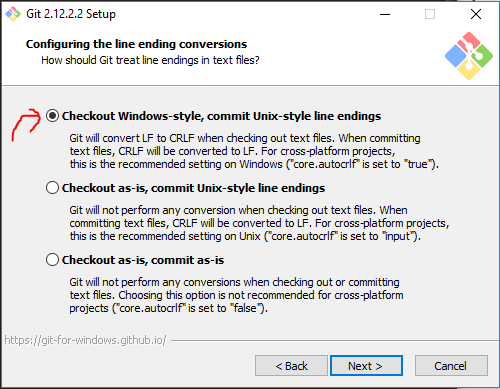

GIT
===

There are other version control systems, but Git is the defacto standard now.  Unlike previous generations of version control where we were building competing products, because Git is free and open source, we're now building collaboration and integration with Git.

Install
-------

1. Download [Git](https://git-scm.com/download).

2. Launch `Git-2.`bunch-a-numbers`.exe`.

3. Click next a few times.

4. Note these important settings:

   

   This says put Git's install directory in `PATH` environment variable.

   

   This says change `\r\n` to `\n` when committing and `\n` to `\r\n` when checking out.  Though it's tempting to choose the "leave it how it is" setting, if one person on your team forgets this setting, you'll see a lot of `^M` at the end of every line in diff views, and Visual Studio will constantly prompt you to normalize line endings.  Better to standardize on this default.

5. Finish the install choices, and complete the install.

6. Restart any services or terminals that depend on git to update the `PATH` environment variable.


Configure
---------

1. Open a new command prompt in any directory.  *Note*: because the installer changed the `PATH` environment variable, existing processes and shells won't be able to run git.

2. Type `git config --global user.name "Sample User"` substituting your first and last name.

3. Type `git config --global user.email "you@example.com"` substituting your email address.  Your name and email become metadata on each commit.


Test it out
-----------

1. Create a directory -- you'll delete it in a minute.

2. Open a new command prompt in this directory.  *Note*: because the installer changed the `PATH` environment variable, existing terminals and shells won't be able to run git.

3. Type these commands:

   ```bash
   git init
   echo "test" > test.txt
   git add test.txt
   git commit -m "test"
   ```

4. If you got no errors in the terminal, git is now installed correctly.

5. Close the terminal, and delete the test directory.


Show File Extensions
--------------------

By default, Windows hides file extensions, so files like `.gitignore` or folders like `.git` just show up as `.` in Windows Explorer.  Let's show file extensions.

1. Start -> Type 'Folder options' until it prompts for `File and Folder Options`.

2. Switch to the `View` tab.

3. Uncheck `Hide extensions for known file types`.

4. Choose `Show hidden files, folders, and drives`.

5. Uncheck `Hide protected operating system files`.

   
