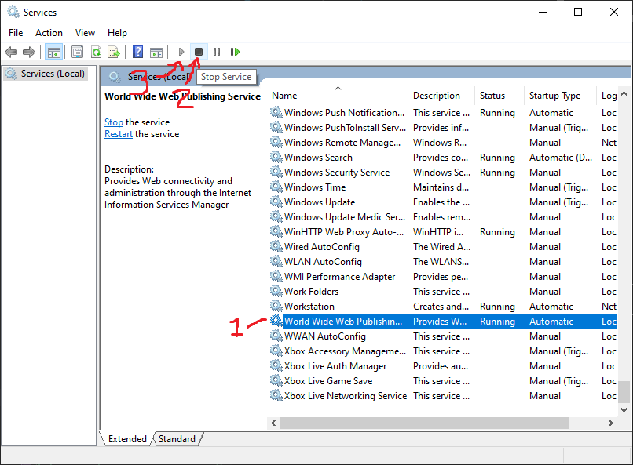

.NET CORE SDK
=============

The .NET Core SDK includes both the build tools and the runtime.  Since we have both the Production web server (IIS) and the build server (TeamCity and Octopus Deploy) on one box, this solves the install for both sides.  In a production environment, the SDK would be installed on the build server, and the .NET Core Runtime would be installed on the web server.


Install .NET Core SDK
---------------------

1. Download [.NET Core SDK](https://dotnet.microsoft.com/download).

2. Launch `dotnet-sdk-`bunch-a-numbers`-win-x64.exe`.

3. Click next a few times and then click finish.

6. Restart any services or terminals that depend on the `dotnet` command line tool to update the `PATH` environment variable.


Test it out
-----------

1. Open a new command prompt in any directory.  *Note*: because the installer changed the `PATH` environment variable, existing terminals and shells won't be able to run git.

2. Type these commands:

   ```bash
   dotnet new --help
   ```

3. After a brief message about telemetry and first-time install, you should see the help message describing the flags available.  .NET is now installed correctly.

4. Close the terminal.


Install ASP.NET Core module in IIS
----------------------------------

By default, ASP.NET uses the Kestrel web server.  If we'd like to host ASP.NET Core content in IIS, we need to load the IIS module.

1. Download the [.NET Core Hosting Module](https://docs.microsoft.com/en-us/aspnet/core/host-and-deploy/aspnet-core-module#how-to-install-and-use-the-aspnet-core-module)

2. Launch `dotnet-hosting-`bunch-a-numbers`-win.exe`.

3. Click next and click finish.

4. From Start menu, open `Services` inside the `Windows Administrative Tools` section.

5. Scroll to the bottom, select the `World Wide Web Publishing Service`, and restart it by clicking the Stop button at the top then the Start button.

   
