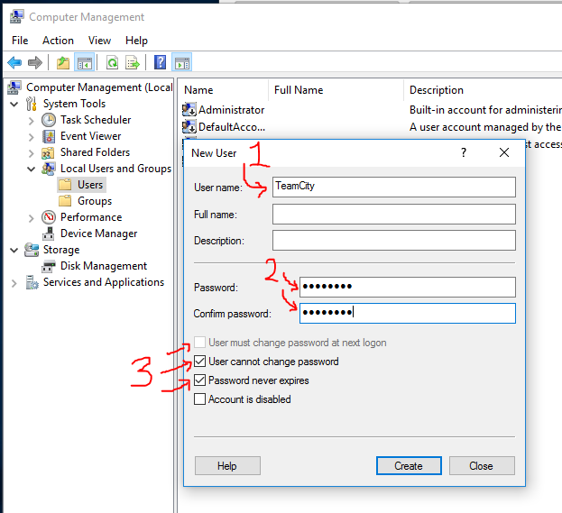
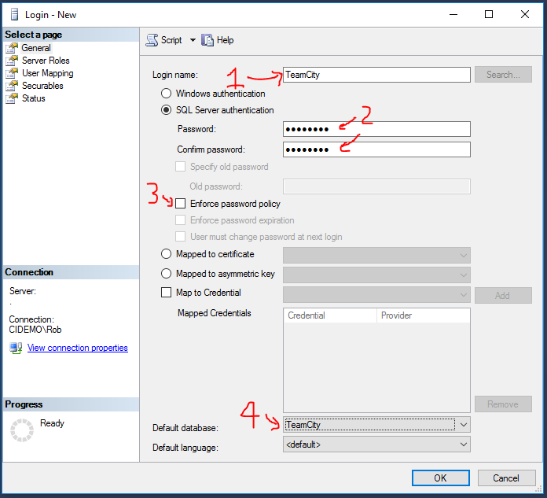
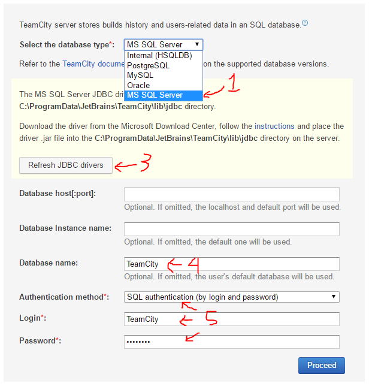

TEAMCITY
========

JetBrains TeamCity is a build server not unlike Jenkins, Team Foundation Server, Cruise Control, or Bamboo.  TeamCity is [free](https://www.jetbrains.com/teamcity/buy/) for up to 3 build agents and 20 build configurations, making it ideal for small companies.

Setup
-----

We'll need a Windows account to run the TeamCity website and build agent.  Technically these can run under the `SYSTEM` account, but there's cases where you'll want to login as the TeamCity account to install certificates or adjust registry keys.  Better to run TeamCity as a regular user.

You could choose to make this a domain user rather than a local user.

1. Right click on `This PC` (formerly `My Computer`), and choose Manage.

2. Choose Local Users and Groups then Users.

3. Right-click in the main window and choose `New User`.

4. Enter necessary user details.

   

5. Ensure `User must change password` is **not** checked, `User cannot change password` is checked, and `Password never expires` is checked.

6. Click `Create`.

7. Open the newly created user, choose `Member Of`, and add `Administrators`.  The user may stop and start services, configure IIS settings, or other behaviors restricted to administrative users, so best to give this account access up front.

Install
-------

1. Download [TeamCity](https://www.jetbrains.com/teamcity/download/)

2. Launch `TeamCity-`bunch_of_numbers`.exe`.

3. Click next until it installs TeamCity.

4. Change the port to `8080` because IIS runs on port 80 by default.

   

5. No changes are needed on this page, but grab a screen shot for reference later.  The TeamCity documentation makes reference to the `System Directory`, `Work Directory`, and the `Data Directory` which is not shown here, but stored in `C:\ProgramData\JetBrains\TeamCity`.

   

6. For both the TeamCity Server and TeamCity Agent, choose to run under a user account.

   

7. Enter the account details for the user created above.

   

8. Choose to Open the TeamCity UI after setup is finished, which will open [http://localhost:8080/](http://localhost:8080/) in your default browser.

Configuration Setup
-------------------

TeamCity will connect via JDBC username/password to SQL Server, so let's set up a database and user.

1. Start -> SQL Server Management Studio (SSMS)

2. Connect to the local database using Windows Authentication.

3. Right-click on Databases, and choose `New Database`.

   

4. Enter the Database Name as `TeamCity`, and click Create.

   

5. Inside the Security group at the bottom, right-click on Logins and choose `New Login`.

   

6. In the General page:

   a. Enter the Login Name as `TeamCity`.
   
   b. Change type to `SQL Server Authentication`.
   
   c. Enter a password.
   
   d. Uncheck `Enforce password policy`.
   
   e. Change the Default database to `TeamCity`.

   

7. Switch to the `User Mapping` page, and set:

   a. Check the database created above.

   b. Set default schema to `dbo`.

   c. Check `db_owner` because TeamCity will create tables.

   

   (Technically you only need `db_owner` as you first configure TeamCity and whenever you upgrade to a new TeamCity version.)

8. Click `OK` to create the user.

Configure
---------

1. If it didn't launch already, open [http://localhost:8080/](http://localhost:8080/) in your favorite browser.

2. Click Proceed.

3. Configure the database connection by choosing:

   a. `MS SQL Server` as the database type.

   b. Click `Refresh JDBC Drivers`.

   c. Enter the database name you created above.

   d. Enter the username and password you created above.

   

   e. Click Proceed.

3. Click next a few times.

4. Create the Administrator account -- the first user login to TeamCity.

5. You may choose to set your name and email address, or skip it by hitting the TeamCity logo on the top-left.

6. Choose Administration on the top-right.

7. In Global Settings, change the `Default VCS trigger quiet period` to `1` second -- the time after it notices changes before it starts building.

   The quiet period allows the server to wait for other commits and build them all together.  60 seconds is great for a real build server, but during this workshop, you won't want to wait a minute after pushing changes before the build kicks up.

7. In Global Settings, change the `Default VCS changes check interval` to `5` seconds.

    60 seconds is great for a real build server, but you won't want to wait a minute after pushing changes before the build server notices.

TeamCity is now setup and ready to add new builds.

Agents
------

At the top of the page, you may see `Agents: 0`.  This is common when you first install TeamCity as it will take a minute or two for the agent to be discovered or to upgrade the agent software.  Let's ignore this for now.
