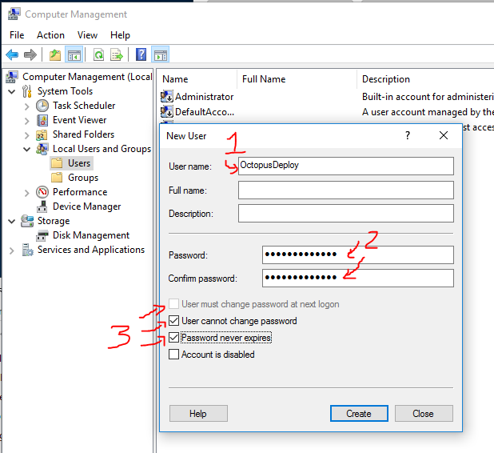
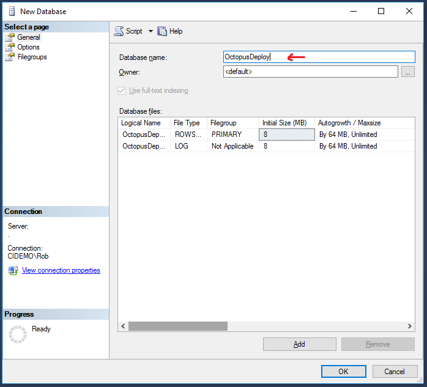
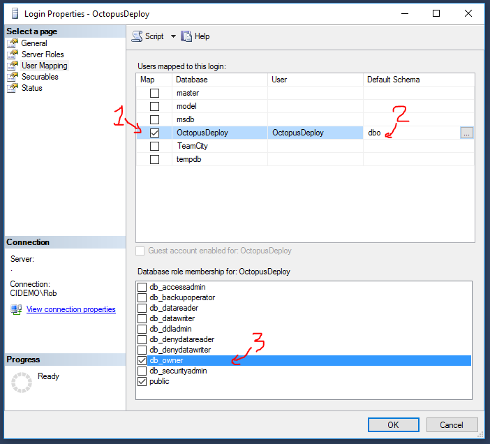
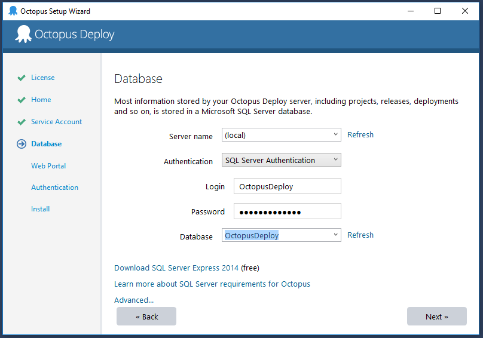
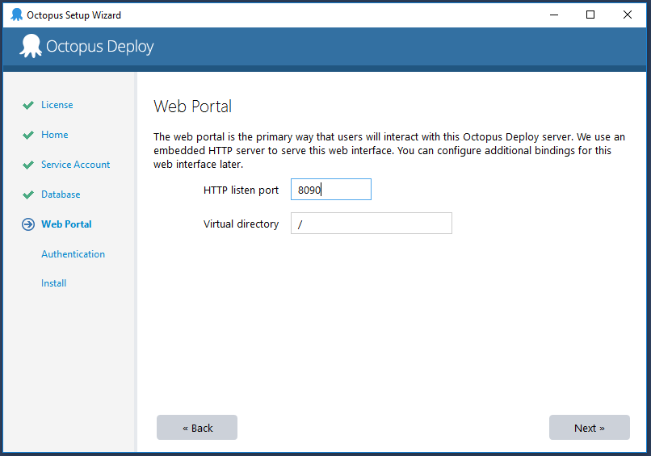

OCTOPUS DEPLOY
==============

Octopus Deploy takes build assets (applications and databases) and deploys them to each environment.  It's easy to promote builds up the stream from dev to test to QA to production.  Octopus includes a [30-day trial](https://octopus.com/purchase).  Sadly, they have removed the free tier.

Setup: Create Windows User
--------------------------

We'll need a Windows account to run the Octopus Deploy website and tentacle agent.  Technically these can run under the `SYSTEM` account, but there's cases where you'll want to login as the OctopusDeploy account to install certificates or adjust registry keys.  Better to run Octopus as a regular user.

You could choose to make this a domain user rather than a local user.

1. Right click on `This PC` (formerly `My Computer`), and choose Manage.

2. Choose Local Users and Groups then Users.

3. Right-click in the main window and choose `New User`.

4. Enter necessary user details.

   

5. Ensure `User must change password` is **not** checked, `User cannot change password` is checked, and `Password never expires` is checked.

6. Click `Create`.

7. Open the newly created user, choose `Member Of`, and add `Administrators`.  The user may stop and start services, configure IIS settings, or other behaviors restricted to administrative users, so best to give this account access up front.

Setup: Create Database
----------------------

Octopus Deploy will connect via username/password to SQL Server, so let's set up a database and user.

1. Start -> SQL Server Management Studio (SSMS)

2. Connect to the local database using Windows Authentication.

3. Right-click on Databases, and choose `New Database`.

4. Enter the Database Name as `OctopusDeploy`, and click Create.

   

5. Inside the Security group at the bottom, right-click on Logins and choose `New Login`.

6. In the General page:

   a. Enter the Login Name as `OctopusDeploy`.
   
   b. Change type to `SQL Server Authentication`.
   
   c. Enter a password.
   
   d. Uncheck `Enforce password policy`.
   
   e. Change the Default database to `OctopusDeploy`.

   

7. Switch to the `User Mapping` page, and set:

   a. Check the database created above.

   b. Set default schema to `dbo`.

   c. Check `db_owner` because Octopus Deploy will create tables.

   

   (Technically you only need `db_owner` as you first configure Octopus Deploy and whenever you upgrade to a new version.)

8. Click `OK` to create the user.

Install Server
--------------

1. Download [Octopus Server](https://octopus.com/downloads).

2. Launch `Octopus.`bunch_of_numbers`.msi`.

3. Push Next a bunch of times.

4. Click Finish to launch the Octopus Manager.

Configure
---------

1. If the Octopus Manager didn't launch automatically from the previous step, launch it from the Start menu.

2. Choose `Custom Domain Account`, then click `Select User` to pick the Windows user you created above.

   

3. Set Server Name to `(local)`, choose `SQL Server Authentication`, and enter the database credentials and database name you created above.

   

4. Change the port to `8090` because IIS runs on port 80 by default.

   

5. Create the first user account to the web portal.

6. Click next a few more times and finish to kick off the install.

7. Click `Open in browser` to launch the Octopus web portal.

Backup Master Key
-----------------

Optional: [backup your master key](https://octopus.com/docs/reference/security-and-encryption) to be able to safely restore secrets stored in Octopus.

Installing the Tentacle
-----------------------

The tentacle is the agent running on each machine that Octopus will deploy software to.

1. Download the [`Octopus Tentacle`](https://octopus.com/downloads).

2. Launch `Octopus.Tentacle.`bunch_of_numbers`.msi`.

3. Click next many times, and click Finish to begin the install.

4. Click `Getting Started` to launch the tentacle setup wizard.

5. Choose `Listening Tentacle`.
     
   A listening tentacle accepts connections from the Octopus server. This is the fastest deployment approach.

   A polling tentacle periodically reaches out to the Octopus server asking for things to do.  This can overcome firewalls where the production network is locked down to inbound traffic.

6. In the Octopus Deploy website at http://localhost:8090/, navigate to Configuration -> More -> Thumbprint. Copy the server thumbprint.

7. Paste the server thumbprint into the Tentacle dialog.

   

8. Click next many more times to complete Tentacle configuration.

Octo.exe Tool
-------------

Octopus Deploy packages are zip files in NuGet format that include all the content and scripts used to deploy sites and services. The `Octo.exe` command-line tool is used to create these packages.

1. Download [Octo.exe Command Line](https://octopus.com/downloads) (Windows 32-bit).

   The `.NET Core` version looks really enticing, but it doesn't work in scripts very well.  Let's stick to the `Windows 32-bit` version.

2. Unzip `OctopusTools.`bunch_of_numbers`.zip` and rename the folder `OctopusTools`.

3. Move the folder into the folder `C:\Program Files (x86)` folder.

4. Start -> Type `environment variables` to launch `Edit System Environment Variables`

5. Click `Environment Variables...`

6. In the lower `System` section, choose `PATH` and click `Edit`

7. Add `C:\Program Files (x86)\OctopusTools` to the list.

8. Start -> Services.

9. Restart both `TeamCity Server` and `TeamCity Build Agent` so they'll get the new `PATH` environment variable.  Restart any other services that depend on `PATH`.

TeamCity Plugin Install
-----------------------

1. Download the [TeamCity plugin](https://octopus.com/downloads) (Windows 32-bit).

2. Launch the TeamCity dashboard at http://localhost:8080/

3. Login if necessary.

4. Click on Administration on the top-right.

5. On the bottom-left, choose `Plugins List`.

6. Click `Upload zip` and upload `Octopus.TeamCity.zip`.

7. Click `Restart server` to apply the changes.
