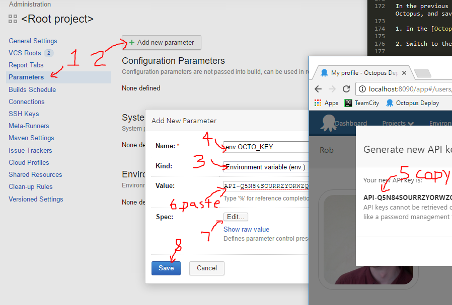

LINK OCTOPUS AND TEAMCITY
=========================

TeamCity will use the Octoups Server API under the hood. In each API call, we need to pass an API key.  This token authenticates TeamCity to Octopus, ensuring only authorized processes can take these actions.

Though we could create an API Key in a user's profile, this leads to problems. How do I tell the difference between the build and the user? What if that person leaves? A service account in Octopus is like a regular account except it doesn't have permission to login.


Create Service Account
----------------------

1. Open the Octopus dashboard at http://localhost:8090

2. Click `Configuration` from the top menu.

3. Click `More` and click `User Roles`.

4. Click `Add Custom Role` on the top-right.

5. Name the role `TeamCity API`.

6. Select these permissions:

   ```
   BuiltInFeedAdminister
   BuiltInFeedPush
   DeploymentCreate
   DeploymentView
   EnvironmentView
   FeedView
   LifecycleView
   MachineView
   ProcessView
   ProjectView
   ReleaseCreate
   ReleaseView
   TaskView
   TenantView
   ```

   Consider carefully if you'd like to give the API the `BuiltInFeedAdminister` permission. This is necessary if the build will replace Octopus artifact packages. In most cases, this is a bad idea.

7. Click `Save` on the top-right.

8. Click on `Configuration` from the top menu, and under `More` click `Users`.

9. Click `Add User`.

10. Set `Username` to `TeamCity`.

11. Set the Display Name to `TeamCity`.

12. Check `The user is a service account`.

13. Click `Save` on the top-right.


Create Team
-----------

Users are not assigned roles, but rather users are assigned to a team, and given roles within the team.

1. Click `Configuration` from the top menu.

2. Click `More` and click `Teams`.

3. Click `Add Team` on the top-right.

4. Name the team `TeamCity API`.

5. Set the team to be `Accessible in all spaces`.

6. Click `Save`.

7. In the User Roles tab, click `Include User Role`.

8. Select the `TeamCity API` role and click `Apply`.

9. Switch to the `Members` tab.

10. Click `Add Member`.

11. Choose `TeamCity` and click `Add`.

12. Click `Save` on the top-right to save the team.


Validate User Permissions
-------------------------

1. Click `Configuration` from the top menu.

2. Click `More` and click `Users`.

3. Click the `TeamCity` user.

4. Under the "hamburger" menu, choose `Test Permissions`.

5. You should see the list of permissions you added to the `TeamCity API` role above.


Create an API Key
-----------------

1. Click `Configuration` from the top menu.

2. Click `More` and click `Users`.

3. Click the `TeamCity` user.

4. Click `Api Keys`.

5. Click `New API Key`.

6. Set the `Purpose` to `TeamCity API`.

7. Click `Generate New`.

   Note the message that says these keys can't be retrieved.  It is easy to generate a new key, but this is the one-and-only time Octopus will show you this key.

   Octopus stores this encrypted at rest. You may choose to backup the [master key](https://octopus.com/docs/reference/security-and-encryption) to be able to safely move secrets to a new Octopus server.

8. Copy the key.

9. Open the [TeamCity Web App](http://localhost:8080), and click `Administration`.

10. Click on `<Root project>` in the middle of the page.

    We save this parameter in the Root project so all builds can use the same key. If we prefer a build-specific user in Octopus, we could create more service accounts and teams, and add the api key to a TeamCity project or build.

11. Click on `Parameters` on the left menu.

12. Click on `Add new parameter`.

13. Change the Kind to `Environment Variable`.

14. Change the Name to `env.OCTO_KEY`.

15. Paste the API Key from Octopus into the Value box.

    

16. In the `Spec` section, click `Edit`.

17. Change Display to `Hidden`.

18. Check the `Read-only` checkbox.

19. Change the Type to `Password`.

    

20. Push save.

21. Push save again.

22. Back in Octopus Deploy, click `Close` to hide the API key.

The key is now saved securely in TeamCity and Octopus Deploy.  Both TeamCity and Octopus Deploy will blur this from console logs, but will use it correctly in scripts.
