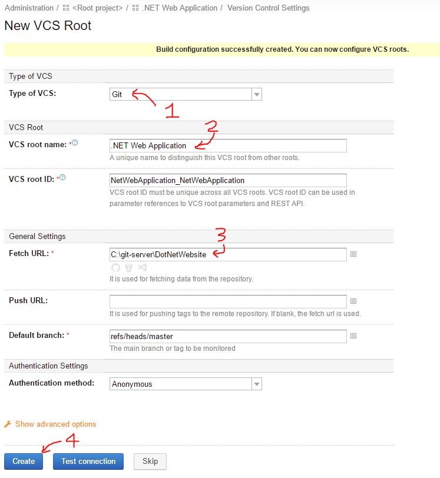
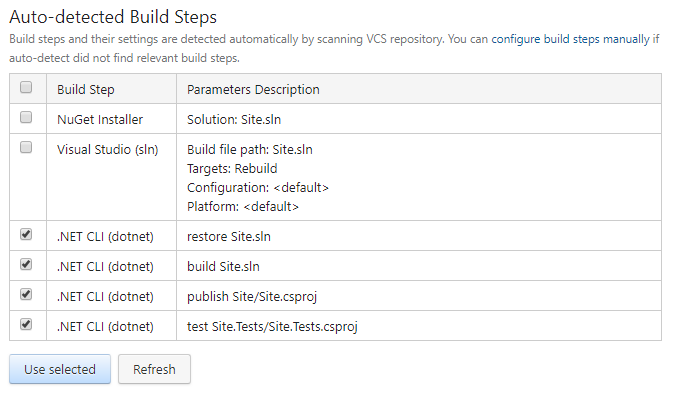
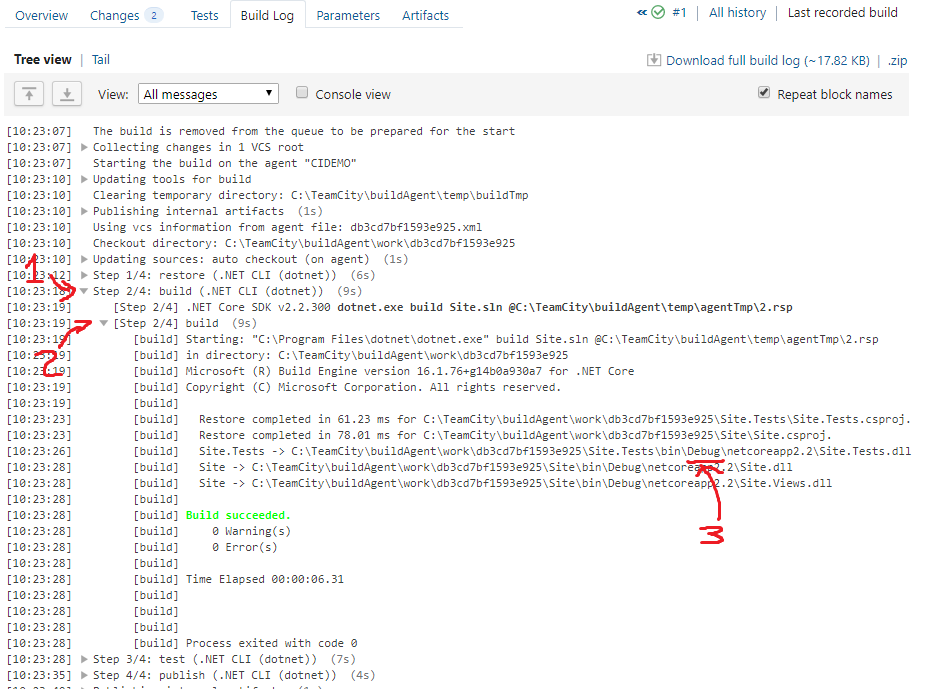
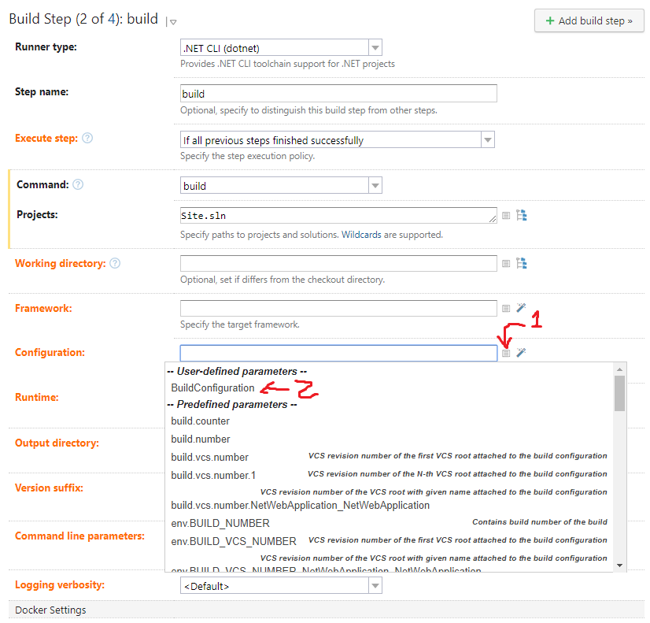

TEAMCITY BUILD
==============

We've already got TeamCity running on [port 8080](http://localhost:8080).  Let's create a build.

Configure
---------

1. Open the TeamCity portal at http://localhost:8080 and login if necessary.

2. Click `Create project`.

3. Click `Manually`.  Though the "From a repository URL" is enticing, our repository url is just a local folder, so it's difficult for TeamCity to discover things about it.

4. Enter the project name `.NET Web Application` and the Project ID will get filled out automatically.

   

5. Click `Create`.

6. In the next screen, click `Create build configuration`.

7. This screen looks really similar to the previous screen.

8. Click `Manually`, enter the name `.NET Web Application`, and the Build configuration will get filled out automatically.

9. Click `Create`.

Create link to Version Control
------------------------------

A "VCS Root" is a link to the source control repository the build will use.

1. From the `Create new VCS Root` menu choose `Git`.

2. Enter `.NET Web Application` as the `VCS Root name`.

3. Enter the Fetch URL as `C:\git-server\DotNetWebsite`.

   

4. Note that authentication to the Git repository is currently set to Anonymous. No change is needed here. If your source control repository was on GitHub or another provider, this would allow you to authenticate to their site.

5. Click `Advanced Options`.

6. Change `Clean policy` to `Always`.

   This ensures previous built content -- dlls, Octopus packages, etc -- gets deleted between builds.

7. Optional: change `Username style` to `Author Name and Email`.

8. Click `Create`.

Create Build Steps
------------------

1. Choose `Build Steps` from the menu on the left.

2. Click `Auto-detect build steps`.

3. Because the .NET Solution file is in the root of the repository, it detected potential build steps both for .NET Framework and for .NET Core.  Pick all the `.NET CLI (dotnet)` steps, then click `Use selected`.

   

4. TeamCity was close in the guess. Sadly, it's publishing before running tests.  Click `Reorder build steps`, drag the `test` step above the `publish` step, and click apply.

5. Optional: The build steps are all named `.NET CLI (dotnet)` making it difficult to reorder.  For each build step, click `Edit`, set the `Step name`, and click `Save` at the bottom.  Now when we click `reorder` it's a lot easier to see.

Source change -> Build trigger
------------------------------

1. Choose `Triggers` from the menu on the left.

2. `Add a new trigger`.

3. Choose `VCS trigger`.

4. Optional: Imagine I've finished a task, and I commit then push a lot of times right in a row. Should TeamCity build each of these commits?  Or should it wait and only build the last commit?  There's two settings that can help here:

   a. `Trigger a build on each check-in`: leave this unchecked for now. It'll only build the latest commit it finds.

   b. `Quiet period`: leave this set to `Do not use` for now. You could choose to wait a minute or two. This could allow me to finish pushing all these changes, and only build the last one.

5. Click Save.

This will start the build every time TeamCity discovers a source code change.

Test it out
-----------

Now that we've got our build configured, let's run it.

1. Click on the TeamCity logo or `Projects` in the top-left.

2. Click `Run` on the far right of the build we created.

   

3. In a minute or two, the build will go green. Congratulations! Celebrate!

4. Click on the `Tests passed` link to see details about the build. Switch to the `Tests` tab to see the unit test details. Switch to the `Build log` tab and expand the arrows to see the console output from the build. Switch to the `Changes` tab to see the git commits that went into this build.

Build in Release mode
---------------------

1. In the TeamCity dashboard, click on the latest build (`#1"`) for `.NET Web Application`.

2. Click on `Build Log`.

3. Click the arrow next to `Step 2/4: build` to open the content.

4. Click the arrow next to `[Step 2/4] build` to open that content.

5. Look at the path of the built output.

   

   It built the debug version.  Oops.  Let's go fix it.

6. Click on `Edit Configuration Settings` on the top-right.

7. Click on `Parameters` on the left.

8. Click `Add new parameter`, set `Name` to `BuildConfiguration`, set `Kind` to `Configuration Parameter`, and set `Value` to `Release`, and click save.

   Though we could hard-code the value of `Release` into each step, creating this build configuration parameter lets us set this value in one place.

9. Click on `Build Steps` on the left.

10. For the `build Site.sln` task, click `Edit`.

11. Click `Show advanced options`.

12. Next to `Configuration`, choose the "hamburger" menu (not the magic wand).

   

13. Pick `BuildConfiguration` from the menu.

    TeamCity now shows the value is `%BuildConfiguration%`. This variable will get swapped in during each build.

14. Optional: we could set other details here such as the .NET Framework version or whether this step should run only if previous steps succeed or run even if the build is failing.

15. Click Save at the bottom.

16. For the `publish Site/Site.csproj` step, click `Edit`, set the `Configuration` to `%BuildConfiguration%` using the "hamburger" menu, and click save.

Test it out
-----------

1. Click `Run` at the top-right to kick off a new build.

2. Click `Projects` or the TeamCity logo on the top-left to switch to the dashboard, then click on the newly running build.

3. Click on the `Build Log` tab and you can watch in real-time as the build executes.

4. Open up each step and ensure all steps now build in `Release` mode.

5. One of them doesn't.  How will you fix this?
