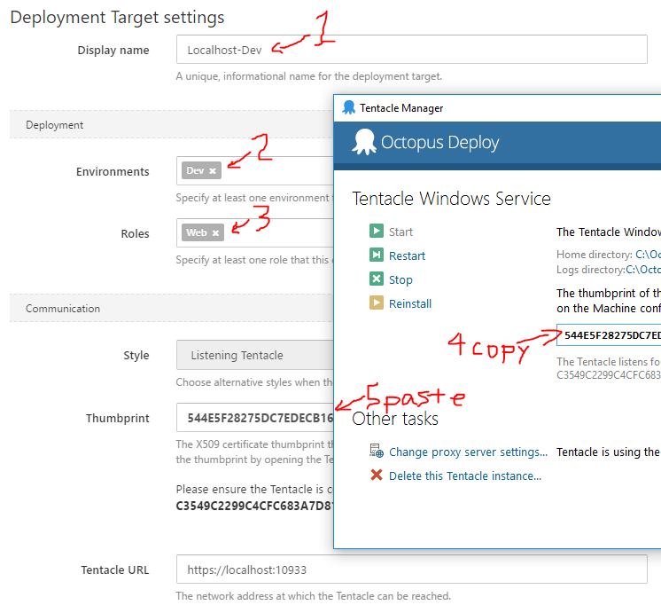
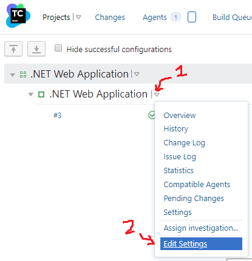
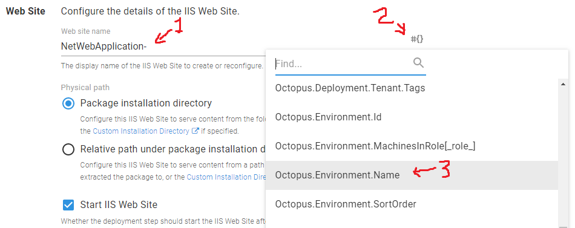

OCTOPUS DEPLOY BUILD
====================

Now that we have a TeamCity build, let's deploy it to IIS with Octopus Deploy.  Octopus Deploy's setup wizard is wonderful at guiding us through all the things.


Create Environments
-------------------

An environment represents a deployment phase.  For example, we could have multiple "Dev" servers, some "Web" servers, some "Database" servers, but they're all "Dev" servers.  "Dev" is the environment, "10.0.0.1" is the "Deployment Target", "Web" is the role.

1. Launch Octopus Web Dashboard at [http://localhost:8090](http://localhost:8090).

   The getting started wizard is wonderful at showing us our progress in building our first deployment. Let's use the menu options instead so we get familiar with where options live once we're done and the wizard is hidden.

2. Click `Infrastructure` at the top.

3. Click `Add Environments` on the top-right, and then `Add Environment`.

4. Name the environment `Dev` and click `Save`.

5. Click `Add Deployment Target` on the top-right.

   A deployment target is a server or cloud resource we'd like to deploy content onto.

   Note that we could choose a `Windows` agent, an `SSH Connection`, `Azure`, `Kubernetes` and many more deployment mechanisms.

6. Click `Windows`.

7. Click `Listening Tentacle`. Octopus Server will reach out to the deployment agent and fire tasks immediately.

8. The screen prompts you to download and install the Tentacle.  We've done this previously.

9. enter `localhost` for hostname.

10. Click `Next` at the top-right.

11. In the next screen, set Display Name to `Localhost-Dev`.

12. Environments is set to `Dev`.

13. In Roles, type `Web` and click `(add new role)`.

14. Optional: From the Start menu, open the Octopus Tentacle Manager, and view the tentacle's thumbprint. Scroll down, and ensure this matches the tentacle you're configuring.

   

15. Click `Save` on the top-right.


Configure Test environment
--------------------------

1. Click `Infrastructure` at the top.

2. Click `Environments` on the left.

3. Click `Add Environment` on the top-right.

4. Name this environment `Test` and click `Save`.

5. Click `Add deployment target` on the top-right.

6. Choose `Windows` and `Add Listening Tentacle`.

7. Enter `localhost` for the hostname, and click `Next` on the top-right.

8. Set Display Name to `Localhost-Test`.

9. Environments is already set to `Test`.

10. Set Roles to `Web`.

11. Optional: validate the tentacle thumbprints match.

12. Click `Save` on the top-right.


Validate it
-----------

1. Click on the `Infrastructure` tab at the top.

2. Note there are 2 environments, 2 deployment targets, and 1 target role.

3. In Target Status, are they "Healthy" or "Healthy with warnings"? 

4. Click on the status.

5. In the hamburger menu on the top-right, choose `Upgrade all tentacles` and `Continue`.

6. Click on `Infrastructure`, click on the status again, and in the hamburger menu, choose `Upgrade Calamari on Deployment Targets`, and click `Continue`.

   In short order, this will upgrade the tentacle and clear the warning.


Add publish build step
----------------------

Next we need to build an Octopus Deploy package, push it to the Octopus server, and trigger a release.  We'll add tasks to use the Octopus Deploy Team City plugin to create the artifacts, push the artifacts to Octopus, and deploy the new release.

1. Launch the TeamCity dashboard at http://localhost:8080/ and login if necessary.

2. Click on the last build for `.NET Web Application` and switch to the `Build Log` tab.

3. Expand `Step 4/4: publish` and `[Step 4/4] publish` to see where it publishes the content.

   The `C:\TeamCity\buildAgent\work\####` part is the folder that the build started in.

   We see the site published to `Site\bin\Release\netcoreapp2.2\publish\`

4. Click on `Projects` or the TeamCity logo to get back to the dashboard.

5. Click on the arrow next to the project, and click `Edit Settings`.

   

6. Click on `Build Steps` on the left.

7. Click `Add Build Step`.

8. Choose `OctopusDeploy: Pack`.

9. Name the step `Octopus Pack`.

10. Set the `Package ID` to `NetWebApplication`.

11. In the `PackageVersion` field, open the hamburger menu and choose `build.number`.

    The field is set to `%build.number%`

12. Set `Source path` to the path we found above: `Site\bin\Release\netcoreapp2.2\publish`.

13. Set the `Output path` to `dist`

14. Click `Save`.


Change Build Number
-------------------

In the previous step, we told Octopus the package version was the build number.  Octopus wants a version number like `1.2.3`, and currently the build number is just `1` or `2`.  Let's change the build number format.

1. Click on `Administration` on the top-right of the TeamCity dashboard.

2. Click on `.NET Web Application`.

3. In `Build Configurations`, in the `.NET Web Application` row, click `Edit`.

4. Click on `General Settings` on the left.

5. If necessary, click `Show advanced options`.

6. Change `Build number format` to `1.0.%build.counter%`.

   Now for build #2, the build number will be `1.0.2`, for build 3 the build number will be `1.0.3`.  This isn't quite [Semantic Versioning](https://semver.org/) but it's close.

7. Click `Save` at the bottom.

8. Note how the changed settings have a yellow highlight on the left.  This could help us quickly scan for unexpected changes.


Publish Octopus Package
-----------------------

1. If you're not there already, navigate to the build settings in TeamCity.

2. Click `Build Steps` on the left.

3. Click `Add build step`.

4. Choose `OctopusDeploy: Push Packages`.

5. Set the step name to `Octopus Push`.

6. Set the `Octopus URL` to `http://localhost:8090/`.

7. In the `API key` field, click the hamburger menu, and choose `env.OCTO_KEY`.

   We built this parameter when we linked Octopus and TeamCity.

8. Set `Package paths` to `dist`.

   This is the destination path when we built the package above.

9. Optional: you may choose to overwrite existing packages. As the message says, this is likely a bad idea.  Because we gave the Octopus `TeamCity API` role the `BuiltinFeedAdminister` permission, we have permission to do this. Alternatively, consider removing the `BuiltInFeedAdminister` permission from the `TeamCity API` role.

10. Click `Save`.


Create Octopus Release
----------------------

1. If you're not there already, navigate to the build settings in TeamCity.

2. Click `Build Steps` on the left.

3. Click `Add build step`.

4. Choose `OctopusDeploy: Create release`.

5. Set the step name to `Octopus Release`.

6. Set the `Octopus URL` and `API key` as we did above.

7. Set `Project` to `NetWebApplication`.

8. In `Release number`, use the hamburger menu to choose `build.number`, setting the field to `%build.number%`.

   Recall previously in General Settings we set `build.number` to be `1.0.%build.counter%` so it'll be `1.0.2`, `1.0.3`, etc.

9. In the `Deployment` section, set `Environment(s)` to `Dev`.

   We could choose instead to create separate build steps for creating the release and deploying the release to an environment.

10. Turn on `Show deployment progress`.

    With this checked, the TeamCity build won't complete until Octopus finishes deploying to the target servers.  If any of the Octopus deployments fail, it'll fail the TeamCity build, and we can see this easily from the TeamCity dashboard.

11. Click `Save` at the bottom.


Create a deployment project
---------------------------

Back in Octopus Deploy, we just did Step 2: Upload your package.  We haven't told Octopus yet since we haven't triggered the build.  Before we do, let's tell Octopus what to do when it releases the .NET Core website.

1. Launch the Octopus Web Dashboard at [http://localhost:8090](http://localhost:8090).

2. Click `Projects` at the top.

3. Click `Add Project` from the top-right.

4. Set the name to `NetWebApplication` -- that's what we called it in the TeamCity build steps.

5. Click `Define your deployment process` on the top-right.

   This deployment process is not specific to an environment (dev, test, etc). Rather it's a single process that works for all environments.

6. Click `Add step`.

7. Choose the `Deploy to IIS` step template.

8. Set the Step Name to `Deploy NetWebApplication`

9. Set `Targets Roles` to `Web` -- it'll deploy to all "web" servers.

10. The Package feed is `Octopus Server (built-in)`.

11. Set the Package ID to `NetWebApplication` -- that's what we called it in the TeamCity build steps.

12. Scroll down, and let's configure more deployment properties.  Here's all the properties we'd usually set in Internet Information Services (IIS).

13. `IIS Web Site` is already selected.

14. Name the WebSite `NetWebApplication-` then click the icon to the right, and pick `Octopus.Environment.Name` from the list.  The full Web Site name is now `NetWebApplication-#{Octopus.Environment.Name}`.  This means for Dev, it'll be `NetWebApplication-Dev` and for Test it'll be `NetWebApplication-Test`.

15. Set Application Pool the same way so it reads `NetWebApplication-#{Octopus.Environment.Name}`

    

16. Set `.NET CLR version` to `No Managed Code`.

    We use `No Managed Code` because we're not deploying a .NET Framework app, we're deploying a .NET Core app.

17. Scroll down to Bindings, and delete the current "Port 80" binding by clicking the grey `X` on the right.

18. Click `Add binding`.

19. Change the port to `800` then pick `Octopus.Environment.SortOrder` from the variable list.  The final port is `800#{Octopus.Environment.SortOrder}`.  This means Dev will be port 8000, and Test will be port 8001.  As long as we have less than 10 environments, this strategy works great.

    In a real-world environment, we'd likely install tentacles on different machines, leave the bindings at port 80 and 443, set a host name in the bindings, and configure certificate details.

20. Click `Save` to complete the binding setup.

21. Turn on `Enable Anonymous authentication`.

22. Turn off `Enable Windows authentication`.

23. Scroll through other settings, adjusting to taste.

24. Note the `Web.<EnvironmentName>.config` section.  If we had `Web.Dev.config` and `Web.Test.config` files in the source, we could automatically transform these settings as part of the deployment.  We could also transform `appSettings.<EnvironmentName>.json` in Additional Transforms.

25. Click `Configure features` and note that it also replaces the `#{Octopus...` variables in config files as well.

26. Click `Save` on the top-right.

Note: There are code changes we should make to ensure .NET Core security features work as expected with Octopus Deploy.  See https://octopus.com/docs/deployment-examples/asp.net-core-web-application-deployments  For this workshop we'll ignore it.


Test it out
-----------

Now that we've got deployment configured in the build, in TeamCity, and in Octopus, let's put it to work.  Let's commit a change and kick off a deployment.

1. In your favorite text editor, open `Site/Views/Shared/_Layout.cshtml`.

2. Search for `class="navbar-brand"` and change the text from `Site` to something interesting.

3. Open a command prompt in the source code directory.

4. Type `git add Site/Views/Shared/_Layout.cshtml` to stage the changes.

5. Type `git commit -m "change title"`

6. Type `git push origin master`

7. Open up the [TeamCity Web Dashboard](http://localhost:8080/) to see the new build kick off. (It may take a bit to discover the changes, schedule the work on the agent, and start the build.)

8. If the build went red the first time, that's ok.  Open up the failed build, switch to the Build Log tab, scroll down, maybe opening up some of the `>` buttons, and look at the gritty details.  Adjust, commit, push, and watch the build.

9. If everything went well, you'll see the build number's new format, the build log shows the Octopus package, the release uploaded to Octopus Deploy, and the release pushed to Dev.

10. Open up the [Octopus Deploy Web Dashboard](http://localhost:8090) to see the release pushed to Dev.

11. Open up Internet Information Services from the Start menu, and see the `NetWebApplication-Dev` website and app pool.

12. Open up the Dev Website at [http://localhost:8000](http://localhost:8000) to see the deployed website.

13. This is a serious milestone.  Jump up and celebrate.  You have an automated build and deployment pipeline!


Break it
--------

What happens if there's a compile fail or a failed unit test?  Let's experiment.

1. In your favorite text editor, open `Site.Tests/UnitTest1.cs`.

2. Change the test to this:

   ```cs
   [Fact]
   public void Test1()
   {
       throw new Exception("fail the build");
   }
   ```

3. Commit and push the changes.

4. Open up the TeamCity dashboard and watch the build.

5. When the build fails, click on it and look through the tabs.

   Can you diagnose the failure from these logs?

6. Fix the test, commit and push the changes, and watch the build go green again.

7. Optional: change some C# code so the site will no longer compile.  (Try taking out a `}`.)  Commit and push this change.

   Can you diagnose the failure from these logs?

8. Ensure the build is green when you're done.
