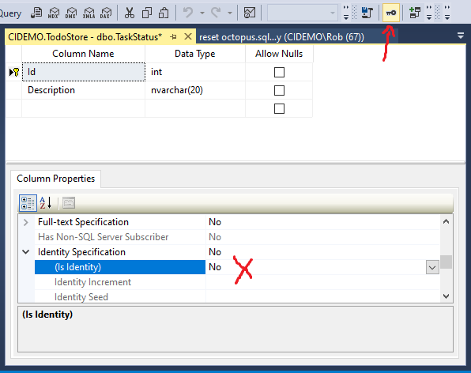
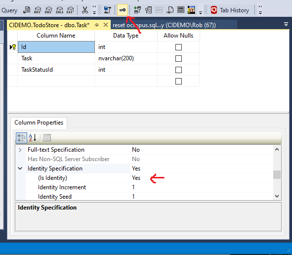
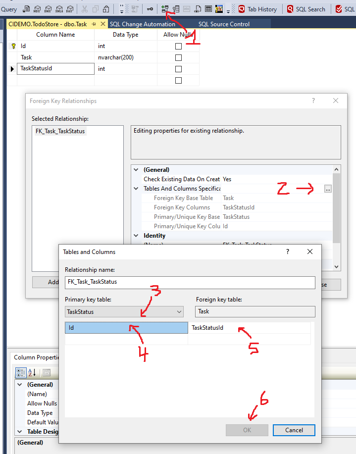

CREATE DATABASE
===============

Let's create the database we'll version.  This database is definitely not complex in it's business logic, but it has enough to see how versioning databases will work.  It has primary keys, a foreign key, static lookup data, and varied data types.  It is a great database to play with as we learn.

New Database
------------

1. Start -> SQL Server Management Studio (SSMS)

2. Connect to the local database using Windows Authentication.

3. In Object Explorer, right-click on Databases and choose `New Database`.

4. Set `Database name` to `TodoStore` and click Create.

Add `TaskStatus` table
----------------------

1. Click `[+]` to open the details of the database, and next to `Tables` click `[+]` again to open the table list.

   There currently aren't any tables in the database.

2. Right-click on the `Tables` folder and choose `New` -> `Table...`.

3. Add a column named `Id`, set Data Type to `int`, and uncheck `Allow Nulls`.

4. With the `Id` column selected, click the Key icon in the toolbar to set this column as a primary key.

5. As an enum table with carefully guarded values, we'll leave `Is Identity` set to false for this table.

6. Add a column named `Description`, set Data Type to `nvarchar(20)`, and uncheck `Allow Nulls`.

   

7. Click the `Save` icon in the toolbar, and name the table `TaskStatus`.

Add `TaskStatus` data
---------------------

1. Right-click on the `Tables` folder on the left and choose `Refresh` to see the new table.

   The table is renamed `dbo.TaskStatus`.  The `dbo` part is the [schema](https://stackoverflow.com/questions/1062075/why-do-table-names-in-sql-server-start-with-dbo) -- roughly like a C# namespace.

2. Right-click on `dbo.TaskStatus` table and choose `Edit Top 200 rows`.

3. Enter this data into the table:

   | Id | Description |
   |----|-------------|
   | 1  | Unstarted   |
   | 2  | InProcess   |
   | 3  | Complete    |
   | 4  | Deleted     |

   The data is saved automatically once you switch to a new row.

Add `Task` table
----------------

1. Right-click on the `Tables` folder and choose `New` -> `Table...`.

2. Add a column named `Id`, set Data Type to `int`, and uncheck `Allow Nulls`.

3. With the `Id` column selected, click the Key icon in the toolbar to set this column as a primary key.

4. In the column properties window, scroll down, open the `Identity Specification` group, and set `Is Identity` to `Yes`.

5. Add a column named `TaskName`, set Data Type to `nvarchar(200)`, and uncheck `Allow Nulls`.

6. Add a column named `TaskStatusId`, set Data Type to `int`, and uncheck `Allow Nulls`.

   

7. With the `TaskStatusId` column selected, select the `Relationships` button in the toolbar.

   

8. Click the `[...]` button next to `Tables and Columns Specification`.

9. On the left, select the `TaskStatus` table, and the `Id` column under it.

10. On the right, keep the `Task` table, and ensure `TaskStatusId` column under it is selected.

12. Click `OK` button and `Close` button to save the foreign key.

13. Click the `Save` icon in the toolbar, and name the table `Task`.

14. Right click on the `Tables` folder on the left and choose `Refresh` to see the new table.
