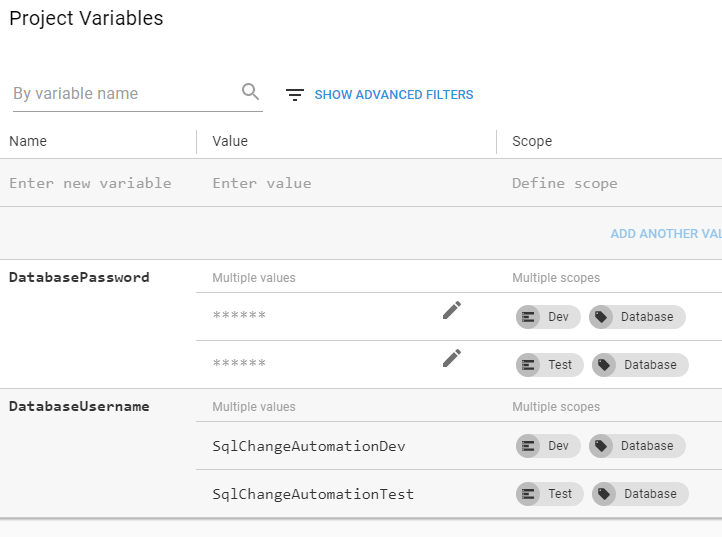

OCTOPUS DEPLOY BUILD
====================

We're old-hat at Octopus now.  Let's setup the Database project and deployment steps.

Create new Target Role
----------------------

Previously we deployed everything to the `Web` servers.  We're now working with a different project that may get deployed to different servers.

1. Launch the Octopus Web Dashboard at [http://localhost:8090](http://localhost:8090).

2. Click `Infrastructure` at the top, and click `Deployment Targets`.

3. Choose `Localhost-Dev`.

4. In the `Target Roles` section, type `Database`, and click `Database (add new)` to create this new role.

5. Click `Save` on the top-right.

6. Click `Infrastructure` again, and `Deployment Targets`.

7. Choose `Localhost-Test`.

8. In `Target Roles`, add `Database` to the list.

9. Click `Save` on the top-right.

10. Click on `Infrastructure` on the top menu.

11. We now see 2 Target Roles: `Database` and `Web`.

12. Clicking on `Deployment Targets`, we see both tentacles are both "Database" and "Web" servers.

    In production scenarios, we'd probably have more servers, and each server would have only one role.  Because we're doing everything on one machine, we've got that one machine doing everything.

Create a deployment project
---------------------------

The SQL Change Automation deployment process involves two Octopus tasks: 1. Pull the package and unzip it to a folder, and then 2. apply the migrations to the database.

1. Launch the Octopus Web Dashboard at [http://localhost:8090](http://localhost:8090).

2. Click `Projects` at the top.

3. Click `Add Project` from the top-right.

4. Set the name to `TodoStore` -- that's what we called it in the TeamCity build steps.

Add first step: download NuGet package
--------------------------------------

1. Click `Define your deployment process` on the top-right.

   This deployment process is not specific to an environment (dev, test, etc). Rather it's a single process that works for all environments.

2. Click `Add step`.

3. Choose `Deploy a Package`.  This step will download the NuGet package that TeamCity pushed, and unzip it into a folder that RedGate can work from.

4. Set the Step Name to `Download TodoStore`.

5. In the `On Targets in Roles` section, type `Database`, then click `Database (add new role)` to create this new role.

   We'll need to add this role to target servers in each environment.  Currently there are no "Database" servers in "Dev", so the build will happily do nothing.

6. The Package feed is `Octopus Server (built-in)`.

7. Set the Package ID to `TodoStore` -- that's what we called it in the TeamCity step.

8. We don't need any config transforms, so we'll leave those settings alone.

9. Click `Save` on the top-right.

Add second step: apply database changes
---------------------------------------

1. Click `Process` then `Add Step` to add a second step to this deployment process.

2. Search for `SQL Change Automation`.

3. Carefully choose the step template `Redgate - Deploy from Package` and choose `Install and Add`.  There are others that are quite similar and wonderfully confusing.

4. Optional: change the Step name

5. Set the `Target Roles` to `Database`.

6. In the `Database package step` section, choose `Download TodoStore` -- the step we created above.

7. Set the `Target SQL Server instance` to `.` -- a single dot to reference the current SQL Server instance.

8. In the `Target database name` section, type `TodoStore`, then click the `#{}` icon on the right, and choose `Octopus.Environment.Name`.

   This sets the final value to `TodoStore#{Octopus.Environment.Name}`.  Therefore the Dev database will be `TodoStoreDev` and the test database will be `TodoStoreTest`.

9. Let's come back to Username and Password.  Leave them blank for now.

10. Click `Save` on the top-right.

Environment-specific credentials
--------------------------------

Let's create the username and password as variables.  Octopus supports two types of variables:

- Project-specific variables: only available in this project

- Library Sets: use these variables in many projects.

We'll use project-specific variables in this case.

1. Within the TodoStore project, click the `Variables` tab and choose `Product`.

2. In the grey area where it says `Enter new variable` type `DatabaseUsername`.

3. In the value column, enter `SqlChangeAutomationDev`.

4. In the Scope column:

   a. Set the Environment to `Dev`.

   b. Set Target Roles to `Database`.

   This ensures this password is only used on `Database` machines in the `Dev` environment.

   Technically this build is only run on Database servers, so this is slightly redundant.  But if this was a library variable, this additional scope would ensure the credentials don't leak into Web servers.

   Note how you could also scope this value down to a particular server or build step.

   In production scenarios, we could use these variables to construct the connection string for the website.

5. Click `Add another value`.

6. In this new row, set the value to `SqlChangeAutomationTest`, and in the Scope column, set the environment to `Test` and roles to `Database`.

7. Click `Save` on the top-right.

8. In the `Enter new variable` spot, type `DatabasePassword`.

9. In the Scope column, set the Environment to `Dev` and the target roles to `Database`.

10. Set the value to the password you used when you created the dev database and user.

11. In this value editor, click `Change Type`, and select `Sensitive`.

    This ensures the value is starred out here and in all the Octopus logs including those shipped into TeamCity during the build.

12. Click `Add another value`, and add the password for the test user. Mark this value as secure, and set the environment to `Test` and the target roles to `Database`.

    

13. Click `Save` to save the values.

Use the variables
-----------------

With the variables defined, we can set them in place in the build task.

1. From the TodoStore project, click the `Process` tab.

2. Select the second step -- the SQL Change Automation step.

3. Scroll down to `Username`, click the `#{}` button, and select `DatabaseUsername`.  This sets the field to `#{DatabaseUsername}`.

4. In the `Password` field, click the chain links ("bind") to reveal the `#{}` button.

5. Click the `#{}` button, and select `DatabasePassword`.

6. Click `Save` on the top-right.

Now that we've defined the steps Octopus Deploy will do to publish the database, we need to tell TeamCity to push the package and trigger the release.

Publish Octopus Package
-----------------------

1. Open the TeamCity portal at http://localhost:8080 and login if necessary.

2. Click on `Administration` on the top-right, click `Projects` on the left if you're not there already, and choose the `TodoStore Database` project.

3. Under `Build Configurations`, in the `TodoStore Database` row, click `Edit`.

4. Click `Build Steps` on the left menu.

5. Click `Add build step`.

6. Choose `OctopusDeploy: Push Packages`.

7. Set the step name to `Octopus Push`.

8. Set the `Octopus URL` to `http://localhost:8090/`.

9. In the `API key` field, click the hamburger menu, and choose `env.OCTO_KEY`.

   We built this parameter when we linked Octopus and TeamCity.

10. Set `Package paths` to `TodoStore.%build.number%.nupkg`.

   This is the destination path when we built the package above.

11. Optional: you may choose to overwrite existing packages. As the message says, this is likely a bad idea.  Because we gave the Octopus `TeamCity API` role the `BuiltinFeedAdminister` permission, we have permission to do this. Alternatively, consider removing the `BuiltInFeedAdminister` permission from the `TeamCity API` role.

12. Click `Save`.

Create Octopus Release
----------------------

1. Click `Add build step`.

2. Choose `OctopusDeploy: Create release`.

3. Set the step name to `Octopus Release`.

4. Set the `Octopus URL` and `API key` as we did above.

5. Set `Project` to `TodoStore`.

6. In `Release number`, use the hamburger menu to choose `build.number`, setting the field to `%build.number%`.

   Recall previously in General Settings we set `build.number` to be `1.0.%build.counter%` so it'll be `1.0.2`, `1.0.3`, etc.

7. In the `Deployment` section, set `Environment(s)` to `Dev`.

   We could choose instead to create separate build steps for creating the release and deploying the release to an environment.

10. Turn on `Show deployment progress`.

    With this checked, the TeamCity build won't complete until Octopus finishes deploying to the target servers.  If any of the Octopus deployments fail, it'll fail the TeamCity build, and we can see this easily from the TeamCity dashboard.

11. Click `Save` at the bottom.

What we've built
----------------

We now have all the pieces in place.

- The development database is in place.

- SQL Change Automation scripted out the database details.

- The TeamCity build will validate the scripts.

- The Octopus Deploy steps will get the schema changes into each environment.

Let's take it for a spin.

Test it out
-----------

1. Open the TeamCity portal at http://localhost:8080, login if necessary, and switch to the home page by clicking `Projects` or the TeamCity logo.

2. In the `TodoStore Database` build, click `Run`.

3. If the build went red the first time, that's ok.  Open up the failed build, switch to the Build Log tab, scroll down, maybe opening up some of the `>` buttons, and look at the gritty details.  Adjust, commit, push, and watch the build.

4. Open up the [Octopus Deploy Web Dashboard](http://localhost:8090) to see the release pushed to Dev.

5. In SSMS, right-click on the `TodoStoreDev` database and choose `Refresh`.

6. Click on the `[+]` buttons to see the tables.

   Check out the tables that got created!

7. Celebration time again!  You just built a DevOps Pipeline for a database.  This is fun!
