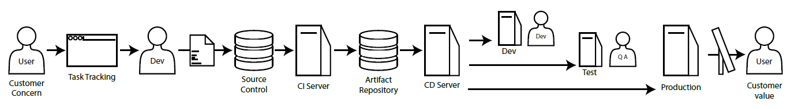
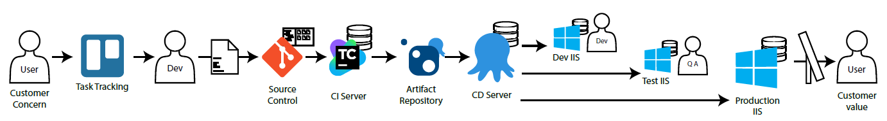
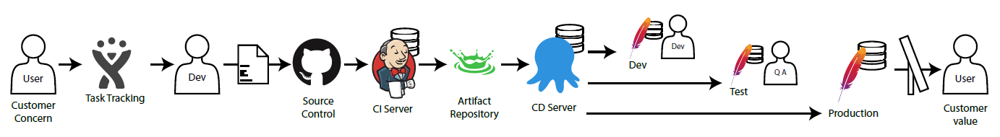
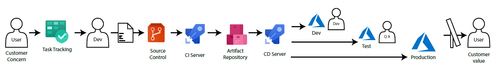

BUILD A DEVOPS PIPELINE FOR .NET APPS AND DATABASES
===================================================

Welcome to the all-day workshop.  We'll start with the fresh install Windows 10 VM you brought, and we'll build CI/CD pipelines using [TeamCity](https://www.jetbrains.com/teamcity/) and [Octopus Deploy](https://octopus.com/) to build a .NET Core Web Application a few different ways, and to deploy database schema updates.  By the end of this day, you'll have a fully functional build, and the skills you need to transform your organization with similar automation.

Prerequisites
-------------

- You need to bring a blank Windows 10 or Windows Server 2016 VM.  Though an existing machine or Windows 7 or 8 *may* work, your mileage may vary.  You can spin up a free trial VM in [Azure](https://azure.microsoft.com/en-us/free/) or [AWS](https://aws.amazon.com/s/dm/optimization/server-side-test/free-tier/free_np/).

- Grab a copy of all the installers from one of the thumb drives going around.  If your machine is outside the conference, download the installers from [CHAPTER_1_Installing/installers.md](installers.md).

Architecture
------------

A typical DevOps pipeline starts with a customer concern and ends with delivering customer value.

We start with a customer concern, add the detail to a task tracking system, and prioritize and schedule the work. A developer pulls a task off the board, codes the content, and commits that to source control.  The build server (continuous integration or C.I. server) notices the change in the repository, and builds the product, running all the tests.  If the build succeeds, it'll publish various artifacts to an artifact repository.  When triggered, the release server (continuous deployment or C.D. server) sends the content to the specified environment -- dev, test, or production.  Once deployed, tests validate the software.  Additional approval steps may be required as we get closer to production.  Once the content is deployed to production, users benefit from this value.

We could use various tools in a DevOps Pipeline.  Perhaps we choose Trello for task tracking, a Git folder on a file-share for source control, TeamCity for the C.I. server, A NuGet repository hosted on Octopus Deploy as the artifact repository, Octopus Deploy for the C.D. server, and IIS hosted on Windows for the dev, test, and production web servers.

We could also choose other tools.  Perhaps we choose Jira for task tracking, GitHub for source control, Jenkins for our C.I. server, Artifactory for the artifact repository, Octopus Deploy for the C.D. server, and Apache web servers in dev, test, and production.

We could also choose Azure DevOps Boards for task tracking, Azure DevOps Repos for source control, Azure DevOps Pipelines for our C.I. server, Azure DevOps Artifacts for our artifact repository, Azure DevOps Pipelines for our C.D. server, and deploy to Azure Web Apps for our dev, test, and production web servers.

We can definitely mix-n-match these choices as well.  Perhaps we use Trello, GitHub, Azure DevOps, Octopus Deploy, and Apache.  Or maybe we choose Azure Boards, BitBucket, TeamCity, Docker, and Kubernetes.  Or maybe we choose Trello, GitLab, Bamboo, a network folder, and deployment tasks in Bamboo to deploy to Tomcat.

Ultimately the tool choices are less important to the process of validating our software in a neutral environment and deploying consistently every time.  Work with your team to choose the tools that best match your needs and make you happy.

What We'll Build
----------------

To keep within the time allotted, we'll focus in on the middle of the pipeline.  Task tracking and production deployments are definitely valuable, but we'll leave those as an exercise for the reader.

Our focus is the automated machinery that'll start when a developer commits code.  The C.I. server will build the content, run tests, publish the website content to the artifact repository where the C.D. server will automatically deploy it to the Dev server.  A user can then promote this content to the Test server.

Tools
-----

- Git runs out of a folder on our drive.  Identical syntax could move this source repo to GitHub, GitLab, or BitBucket.

- TeamCity is our C.I. server.  We'll trigger it to poll against the Git folder looking for changes.  It'll kick off various tasks to build and test the software.

- Octopus Deploy is our C.D. server.  It'll deploy content to dev on each build, and we'll push one button to get it to test.  The beauty of separating this deployment server from the build server is we can publish to a new environment without rebuilding the software.

- Octopus Deploy is also our artifact repository.  The built-in NuGet server will house built content.

- We'll use IIS for our web server.  This server is built into Windows.

Why did we choose these tools?  These tools simulate an on-prem build pipeline that could run behind the firewall.  This is great in spotty-wifi conference scenarios.  These tools are also cost-effective and easy to use.  You could use these same techniques with cloud-hosted DevOps tools like Circle CI, Travis CI, Azure DevOps, and CodeFresh.io.

Tasks
-----

- Chapter 1 is the "Ops" side of things.  We'll install TeamCity with the supporting database and user, install Octopus Deploy with the supporting database and user, install the IIS web server, and install build tools.

- Chapter 2 builds a DevOps pipeline for web apps using TeamCity tasks.  With this pipeline complete, a commit to source control will automatically build the .NET website and publish it to the Dev server.  One button click gets it to the Test server.

- Chapter 3 crafts a build script for web apps that does all the build and deployment tasks.  TeamCity will only start this script.  This approach is great if you need independence from the build server or need to migrate to a new build server quickly.

- Chapter 4 builds a DevOps pipeline for databases using TeamCity tasks.  Like the DevOps pipeline for websites, a commit to source control triggers the C.I. server to validate the software, and deploy it to the Dev database.  Click go in Octopus Deploy and the database schema changes are deployed to test.

- Chapter 5 moves the database pipeline to a build script.  Welcome to the deep end.  Can you use the techniques we used in Chapter 3 to build this script?

- Chapter 6 is a bit of refactoring of Chapter 2.  Let's move common settings from TeamCity tasks into TeamCity variables to eliminate duplication and make it easier for these to change.

We'll discuss many best practices throughout this workshop, but the majority of the experience is a self-directed journey through installing and configuring each tool.  Work as quickly or as slowly as you'd like.

Each folder has a `README.md` file that walks you through the steps for this task.  View these files on GitHub or in VS Code, right-click on the file and choose Open Preview or use your favorite Markdown reader.

About the Author
----------------

Rob Richardson is a software craftsman building web properties in ASP.NET and Node, React and Vue. He's a Microsoft MVP, published author, frequent speaker at conferences, user groups, and community events, and a diligent teacher and student of high quality software development. You can find this and other talks on his blog at [https://robrich.org/presentations](https://robrich.org/presentations) and follow him on twitter at [@rob_rich](https://twitter.com/rob_rich).

License: MIT
------------
Copyright (c) 2019 Richardson & Sons, LLC

Permission is hereby granted, free of charge, to any person obtaining a copy
of this software and associated documentation files (the "Software"), to deal
in the Software without restriction, including without limitation the rights
to use, copy, modify, merge, publish, distribute, sublicense, and/or sell
copies of the Software, and to permit persons to whom the Software is
furnished to do so, subject to the following conditions:

The above copyright notice and this permission notice shall be included in all
copies or substantial portions of the Software.

THE SOFTWARE IS PROVIDED "AS IS", WITHOUT WARRANTY OF ANY KIND, EXPRESS OR
IMPLIED, INCLUDING BUT NOT LIMITED TO THE WARRANTIES OF MERCHANTABILITY,
FITNESS FOR A PARTICULAR PURPOSE AND NONINFRINGEMENT. IN NO EVENT SHALL THE
AUTHORS OR COPYRIGHT HOLDERS BE LIABLE FOR ANY CLAIM, DAMAGES OR OTHER
LIABILITY, WHETHER IN AN ACTION OF CONTRACT, TORT OR OTHERWISE, ARISING FROM,
OUT OF OR IN CONNECTION WITH THE SOFTWARE OR THE USE OR OTHER DEALINGS IN THE
SOFTWARE.
